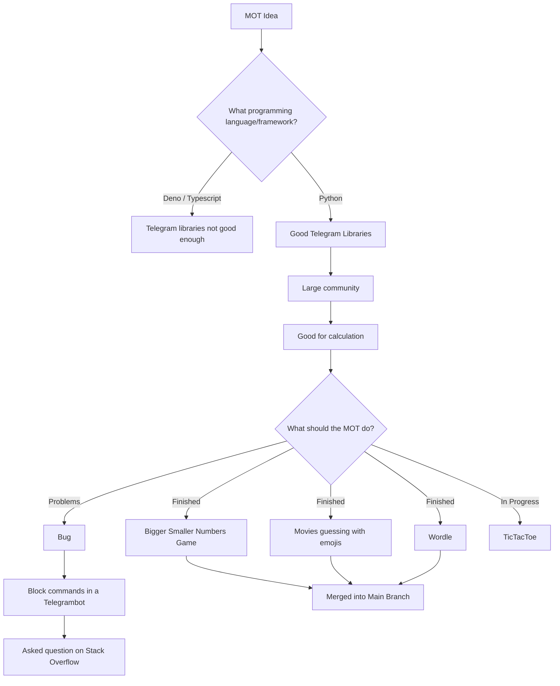

# MOT-Multi-Functional-Bot

<div align="center">
    <small>Built by:
        <a href="https://github.com/lea-s">Lea</a>,
        <a href="https://github.com/natibckr">Natascha</a>,
        <a href="https://github.com/fulachs">Felix</a>,
        <a href="https://github.com/nowo2000">Noah</a> and all
        <a href="https://github.com/NoWo2000/MOT-Multi-Functional-Bot/graphs/contributors">contributors</a>
    </small>
</div>


[](https://github.com/NoWo2000/MOT-Multi-Functional-Bot/issues)


---

- You are bored, then write to your MOT and he will help you pass the time by playing a game with you.
- Optionally expandable with more games and ways to pass the time.
- In addition, he can tell you a lot of information or pictures about different things to pass the time
- The focus is on a working mini-game, playable in Telegram with the bot. After that more modules (games or random facts) are planned.

## How to start your own MOT-Bot
1. Text our running MOT on Telegram via (PENDING)
2. Create your own MOT:
    - Clone this repository
    - install all requirements:

    ```bash
    pip3 install -r requirements.txt --upgrade
    ```
    - Rename the `conf.template.py` to `conf.py` and add your personal API-Key.
        - If you don't know how to do this open the `conf.template.py` and read the instructions.
    - To run the bot go to your console and type:

    ```bash
    python3 main.py
    ```
    - To get all the functionalities type `/help`. For further information visite the [MOT-Bot Wiki](https://github.com/NoWo2000/MOT-Multi-Functional-Bot/wiki) page.


## You need help with this repo?

In case Commandos or other things are not clear, there is a detailed documentation of our repo under the Wiki tab.
Or if you have any other questions about telchnology decisions, or you have questions about tools or scaling the bot, check out the wiki page. [MOT-Bot Wiki](https://github.com/NoWo2000/MOT-Multi-Functional-Bot/wiki)

## Project history


