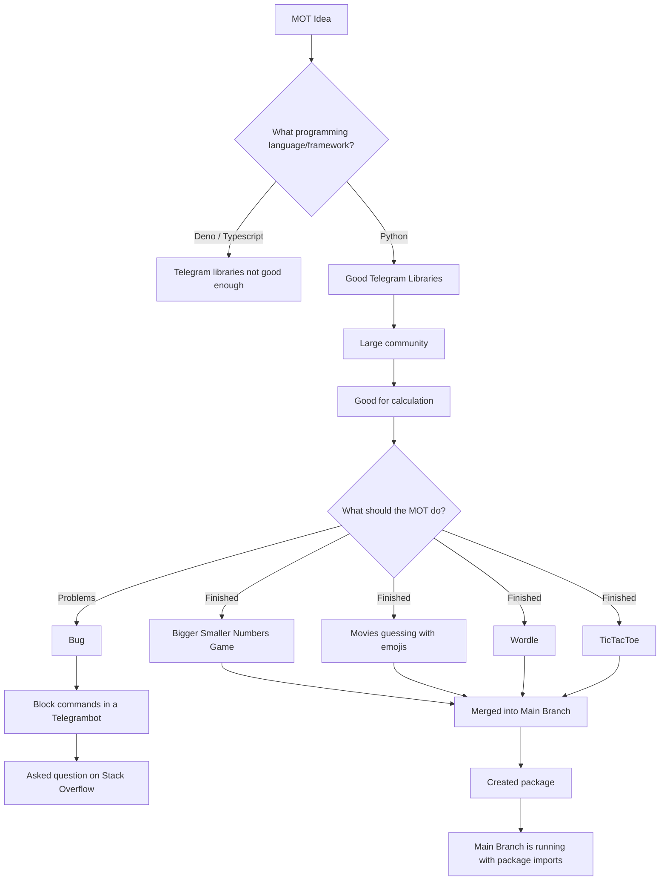

<p align="center">
 
 <a href="https://github.com/MOT-Multi-Functional-Bot/MOT-Multi-Functional-Bot/" alt="LOGO" >
        </a><br><br>
</p>

<div align="center">
    <small>Built by:
        <a href="https://github.com/lea-s">Lea</a>,
        <a href="https://github.com/natibckr">Natascha</a>,
        <a href="https://github.com/fulachs">Felix</a>,
        <a href="https://github.com/nowo2000">Noah</a> and all
        <a href="https://github.com/MOT-Multi-Functional-Bot/MOT-Multi-Functional-Bot/graphs/contributors">contributors</a>
    </small>
</div>

<br>

<p align="center">
 
 <a href="https://github.com/MOT-Multi-Functional-Bot/MOT-Multi-Functional-Bot/commits/main" alt="last commit">
        </a>
 <a href="https://github.com/MOT-Multi-Functional-Bot/MOT-Multi-Functional-Bot/issues" alt="issues">
        </a>
 <a href="https://github.com/MOT-Multi-Functional-Bot/MOT-Multi-Functional-Bot" alt="total lines">
        </a>
 <a href="https://github.com/MOT-Multi-Functional-Bot/MOT-Multi-Functional-Bot" alt="top language">
        </a>
</p>

---

- You are bored, then write to your [MOT](https://t.me/waseinbot) and he will help you pass the time by playing a game with you.
- Optionally expandable with more games and ways to pass the time.
- In addition, he can tell you a lot of information or pictures about different things to pass the time
- The focus is on a working mini-game, playable in Telegram with the bot. After that more modules (games or random facts) are planned.

# How to start your own MOT-Bot

You can run our bot directly in python or run it in a docker container!

## Use a docker container

- Clone the repository
- Rename the `conf.template.py` to `conf.py` and add your own API-Key.
  If you don't know how to do this open the `conf.template.py` and read the instructions.
- Run:

```bash
   docker-compose up -d
```

## Run it directly in python

Create your own MOT:

- Clone this repository
- Install all requirements:

```python
pip3 install -r requirements.txt --upgrade
```

- Rename the `conf.template.py` to `conf.py` and add your personal API-Key.
  - If you don't know how to do this open the `conf.template.py` and read the instructions.
- To run the bot go to your console and type:

```python
python3 main.py
```

- To get all the functionalities type `/help`. For further information visit the [MOT-Bot Wiki](https://github.com/MOT-Multi-Functional-Bot/MOT-Multi-Functional-Bot/wiki) page.

## Use our Python Package

- You can use our python package by following the installation instructions on [MOT-Bot-Game Package](https://test.pypi.org/project/MOT-Bot-Games/)
- After installing the package you can use the following commands to get started with the individual games:

```python
pip install -i https://test.pypi.org/simple/ MOT-Bot-Games

import moviegame
import numbergame
import wordle
import tictactoe
```

- For more information, feel free to check out our [Wiki](https://github.com/NoWo2000/MOT-Multi-Functional-Bot/wiki).

# You need help or further information of this repo?

In case Commandos or other things are not clear, there is a detailed documentation of our repo under the Wiki tab.
Or if you have any other questions about technology decisions, or you have questions about tools or scaling the bot, check out the wiki page. [MOT-Bot Wiki](https://github.com/MOT-Multi-Functional-Bot/MOT-Multi-Functional-Bot/wiki)

# Project history


