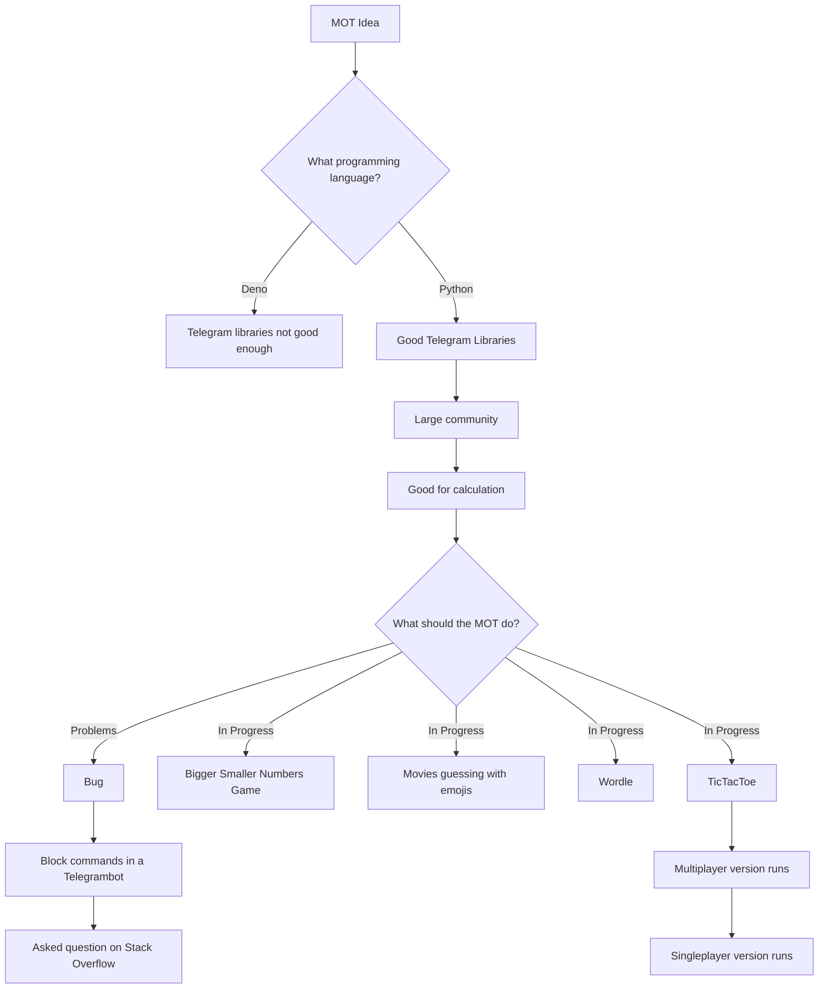

# MOT-Multi-Functional-Bot

- You are bored, then write to your MOT and he will help you pass the time by playing a game with you.
- Optionally expandable with more games and ways to pass the time.
- In addition, he can tell you a lot of information or pictures about different things to pass the time
- The focus is on a working mini-game, playable in Telegram with the bot. After that more modules (games or random facts) are planned.

## Project history

